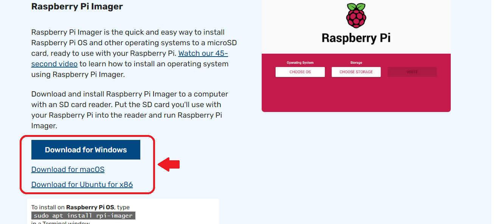
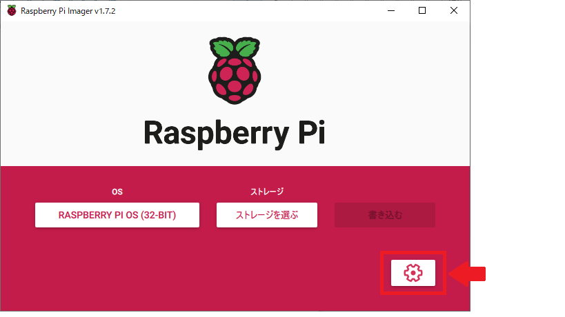
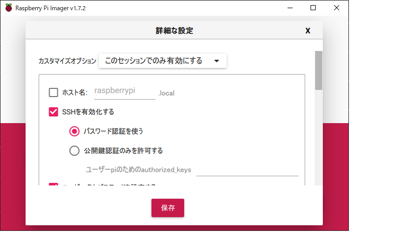
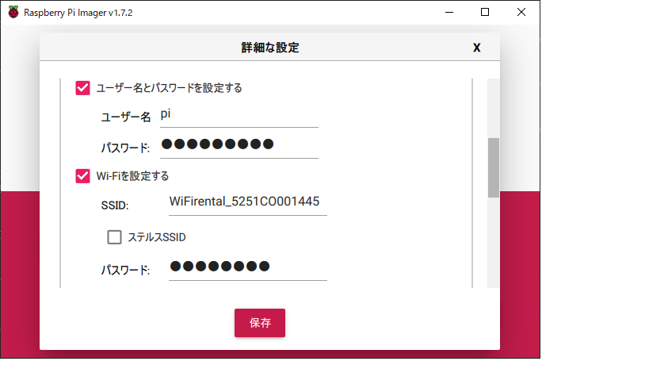
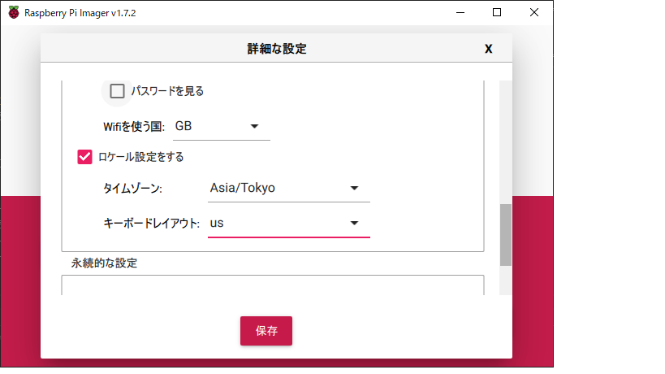
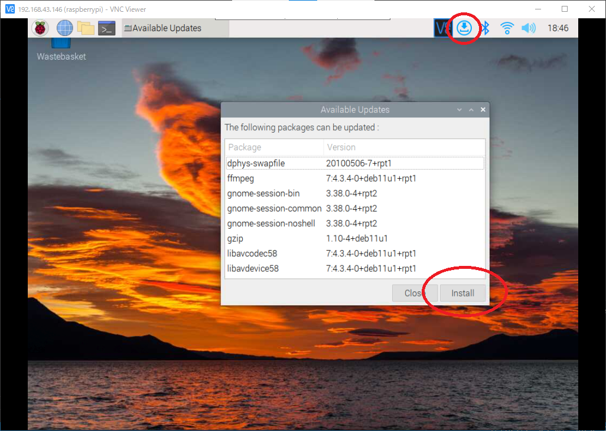

# Raspbeery Pi OSインストール方法  
## 目次
- [OSのインストール方法](#content1)
- [Wifi設定の手順](#content2)
- [Tera Termによる接続確認](#content3)
- [VNCの有効化](#content4)
- [Raspberry Pi OS設定](#content5)
- [VNC Viewerが遅いときの対応方法](#content6)

<h2 id="content1">OSのインストール方法</h2>  

- Raspberry Piに使用するSDカードを自分のPCに接続  
- インストーラを以下のURLからダウンロードする。  
https://www.raspberrypi.com/software/  
  

※Imagerのバージョンが1.7.2になったことにより、操作画面の英語が日本語になりました。  

- ダウンロードしたインストーラ（~~imager_1.7.1~~ imager1.7.2.exe）を起動し、インストールを行う。
- Raspberry Pi Imagerが起動したら、「CHOOSE OS」をクリック。  


- 「Operating System」から一番上を選択。  


- 次に「Storage」を選択。  


- PCに接続したSDカードを選択。  


※ここからImager1.7.2に追加された内容  
右下の歯車をクリック  
  

「SSHを有効化する」にチェックをつけ、「パスワード認証を使う」を選択状態にする  


下にスクロールし、「ユーザー名とパスワードを設定する」にチェックをつけ  
パスワードを設定する(ここでは使い慣れている「raspberry」としたが、何でもよい)  
また、「Wi-Fiを設定する」にチェックをつけ  
使用するWi-FiのSSIDとパスワードを入力する  
  

さらに下にスクロールし、「ロケール設定する」にチェックをつけ  
タイムゾーンを「Asia/Tokyo」にする  
  

ここまで出来たら、一番下の「保存」を押す   

- 「WRITE」を選択して、書き込みを行う。(10分ほど掛かります)  


<h2 id="content2">Wifi設定の手順</h2>  

※Imagerのバージョン1.7.2の手順に従っている場合、「Wi-Fi設定の手順」は飛ばしてよい  
- SDカードに書き込みが終わった後、（今回は）Dドライブ直下に「ssh」という空のファイルを新規作成。  
  

- 同様のディレクトリにテキストを新規作成し、内容を編集し「wpa_supplicant.conf」という名前で保存。編集内容は以下の通り  

```  
ctrl_interface=DIR=/var/run/wpa_supplicant GROUP=netdev
update_config=1
country=JP

network={
        ssid="1つ目のSSID"
        psk="1つ目のSSIDのパスワード"
        key_mgmt=WPA-PSK
}  
```

  

<h2 id="content3">Tera Termによる接続確認</h2>  

- 上記の手順が終われば、自分のPCからSDカードを抜いて、Raspberry PiにSDカードを入れる。   
- Raspberry Piの電源をつける。 
- Raspberry PiのIPアドレスを調べる。  
【参考：Raspberry PiのIPアドレスの調べ方】  
 確実にIPアドレスがわかる方法が確立していないため、例としていくつか紹介します。
  - Windowsのコマンドプロンプトから「arp -a」を実行すると  
  　同一セグメント内に存在するIPアドレス-物理アドレスの一覧が表示されるため  
      

    その中からRaspberry PiのIPアドレスを推測する。（pingを使うとか...）  
  　※arp -aでRaspberry PiのIPアドレスが出てこないことがあります。  
  - RaspbBerry Piの電源をつけ、ディスプレイと接続しIPアドレスを直接調べる。  
    ※今のところ、このやり方のほうが確実です。  
- Tera Termを起動して接続確認。  

  

- Raspberry Piのデフォルトのユーザー名とパスフレーズは  
  - ユーザー名：pi  
  - パスフレーズ：raspberry  
  
    
- 以下の画面が表示されたら、接続成功。
  
 
<h2 id="content4">VNCの有効化</h2>  

- Tera Termから以下のコマンドを実行（VNCの有効化を行う）  
```  
sudo raspi-config
```  

- 「3 Interface Options」を選択し、Enter  
  

- 「I3 VNC」を選択し、Enter  
  

- 「Yes」を選択しEnter  
  

- VNCの有効化が出来たので、VNC Viewerで接続する。(ユーザー名、パスワードはデフォルト)  
  

<h2 id="content5">Raspberry Pi OS設定</h2> 
 
- Raspberry Piの画面が表示される。  
  

- ここからRaspberry PiのOSの設定を行う。  
※以下の手順はImager1.7.2の手順に従っている場合、必要ない  
  上画面から「Next」をクリック。  
- 「Country」のコンボボックスから「Japan」を選択し、Nextをクリック。  
  

- 新規パスワードの設定はそのままにするので、「Next」をクリック。  
  

- 「Next」をクリック。  
  

- 接続先のWi-Fiのネットワークを選択し、「Next」をクリック。  
  

- ソフトウェアのアップデートを行うので、「Next」をクリック。(10分ほどかかる)  
  

- 再起動を行うため、「ReStart」をクリック。
  
以上でセットアップは終了。  

※右上にソフトウェアのアップデートがある場合、アップデートを行うこと  
  

<h2 id="content6">VNC Viewerが遅いときの対応方法</h2> 

 - 以下の記事を参考  
https://note.com/arcana_tech/n/na53f47a1cfc6  